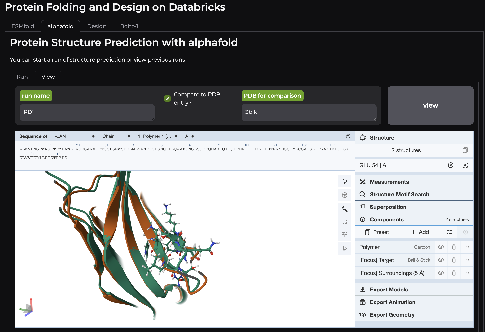

# Protein Folding and Generative Protein Models on Databricks

The ability to computationally predict the 3D structure of proteins with near-experimental accuracy is revolutionizing bioinformatics research and the way drug discovery is done. The release of AlphaFold2 by DeepMind, which won the CASP14 competition, and RoseTTAFold from the Baker Lab were the first such models to demonstrate such high performance and played a key role in the decision to award three of the researchers involved in these works the 2024 Nobel Prize in Chemistry. Many biotech and pharmaceutical organizations are using these models, including generative models for protein design, to reimagine how AI can shape their R&D businesses. Use cases include not only predicting structures to speed up analysis but also downstream prediction of molecule properties, drug-binding, and perhaps most excitingly, generating new drugs against targets. We show how model serving, workflows, and apps on Databricks allow one to have an all-in-one platform for both protein folding and even generative protein design with a variety of cutting-edge models. These models are easy to use for both expert and wet-lab scientists and are well-governed: organizations can track how the models are used, a key consideration for data of high proprietary value. Model serving on Databricks allows for the GPU compute on the endpoint to scale up and down with use, including scaling to zero, which prevents cost in periods when models are not in use.  

  

**What's inside?** Tutorials for:

**Structure Prediction Models:**
- AlphaFold v2.3.2: uses Databricks workflows to download required datasets and can install workflows for separated CPU and GPU compute.
- ESMFold: model serving of ESMFold
- Boltz-1: model serving of Boltz-1

**Generative Protein Modelling Tools:**
- RFDiffusion: model serving of unconditional protein generation and in-painting protein generation
- ProteinMPNN: model serving of protein sequence inference of protein backbones

**Apps:**
- Notebooks and source code to generate a protein folding app that can run model serving in real-time and submit and view AlphaFold workflow runs.

## Installation
Inside /setup you can run the "install" notebook and models will be registered and served with model serving, an AlphaFold workflow will be created, and the UI for easy interaction with models will be provisioned. 

License
--------
Please see LICENSE for the details of the license. Some packages, tools, and code used inside individual tutorials are under their own licenses as described therein. Please ensure you read the details of the tutorials and licensing of individual tools. Other third-party packages are used in tutorials within this accelerator and have their own licensing, as laid out in the table below. This accelerator uses multiple packages that may be outdated and have security issues due to upstream hard dependencies requirements of models. Use at your own risk. We note also that we made minor modifications to AlphaFold2 code in both the AlphaFold and Boltz-1 tutorials; notes on the changes made can be found in those tutorials. The ProteinMPNN package was reformatted from source in order to be packageable with pip. In the app tutorial, we additionally modified examples from Modal-labs model-examples repo (MIT) for Mol* viewer HTML construction; this is noted in the application tutorial also. NVIDIA GPUs and cudatoolkit may be used in multiple places, so you should consider the [NVIDIA EULA](https://docs.nvidia.com/cuda/eula/index.html) when using code in this package.

Tutorial | Package | License | Source
-------- | ------- | ------- | --------
RFDiffusion | RFDiffusion |	BSD-3 | https://github.com/RosettaCommons/RFdiffusion
RFDiffusion | Mlflow	| Apache2.0 | https://github.com/mlflow/mlflow
RFDiffusion | Hydra	| MIT | https://github.com/facebookresearch/hydra
RFDiffusion | OmegaConf |	BSD-3 | https://github.com/omry/omegaconf
RFDiffusion | Biopython |	[BioPython License Agreement](https://github.com/biopython/biopython/blob/master/LICENSE.rst) | https://github.com/biopython/biopython
RFDiffusion | DGL	| Apache2.0 | https://github.com/dmlc/dgl
RFDiffusion | pyrsistent |	MIT | https://github.com/tobgu/pyrsistent
RFDiffusion | e3nn	| MIT | https://github.com/e3nn/e3nn
RFDiffusion | Wandb |	MIT | https://github.com/wandb/wandb
RFDiffusion | Pynvml	| BSD-3 | https://github.com/gpuopenanalytics/pynvml
RFDiffusion | Decorator	| BSD-2 | https://github.com/micheles/decorator 
RFDiffusion | Torch |	BSD-3 | https://github.com/pytorch/pytorch
RFDiffusion | Torchvision |	BSD-3 | https://github.com/pytorch/vision
RFDiffusion | torchaudio==0.11.0 |	BSD-2 | https://github.com/pytorch/audio
RFDiffusion | cloudpickle==2.2.1	| BSD-3 | https://github.com/cloudpipe/cloudpickle
RFDiffusion | dllogger 	| Apache2.0 | https://github.com/NVIDIA/dllogger
RFDiffusion | SE3Transformer |	MIT | https://github.com/RosettaCommons/RFdiffusion/tree/main/env/SE3Transformer
RFDiffusion | MODEL WEIGHTS |	BSD | https://github.com/RosettaCommons/RFdiffusion
ProteinMPNN | ProteinMPNN 	| MIT | https://github.com/dauparas/ProteinMPNN
ProteinMPNN | Numpy |	BSD-3 | https://github.com/numpy/numpy
ProteinMPNN | torch==1.11.0+cu113 |	BSD-3 | https://github.com/pytorch/pytorch
ProteinMPNN | torchvision==0.12.0+cu113 |	BSD-3 |  https://github.com/pytorch/vision 
ProteinMPNN | torchaudio==0.11.0 | BSD-2 | https://github.com/pytorch/audio
ProteinMPNN | mlflow==2.15.1 | Apache2.0 | https://github.com/mlflow/mlflow
ProteinMPNN | cloudpickle==2.2.1 | BSD-3 | https://github.com/cloudpipe/cloudpickle
ProteinMPNN | biopython==1.79 | [BioPython License Agreement](https://github.com/biopython/biopython/blob/master/LICENSE.rst) |  https://github.com/biopython/biopython
ProteinMPNN | MODEL WEIGHTS | MIT | https://github.com/dauparas/ProteinMPNN
Alphafold | AlphaFold (2.3.2) | Apache2.0 | https://github.com/google-deepmind/alphafold
Alphafold | other dependencies | we provide a file of requirements per AlphaFold's own [repo](https://github.com/google-deepmind/alphafold), see [yml file](https://github.com/databricks-industry-solutions/hls-proteinfolding/blob/main/tutorials/alphafold/workflow/envs/alphafold_env.yml) for further details |
Alphafold | MODEL WEIGHTS | CC BY 4.0
ESMfold | ESMFold |	MIT | https://github.com/facebookresearch/esm
ESMfold | torch | BSD-3 | https://github.com/pytorch/pytorch
ESMfold | transformers | Apache2.0 | https://github.com/huggingface/transformers
ESMfold | accelerate | Apache2.0 | https://github.com/huggingface/transformers
ESMfold | MODEL WEIGHTS | MIT
Boltz-1 | Boltz-1 |	MIT | https://github.com/jwohlwend/boltz
Boltz-1 | packaging |Apache2.0 | https://github.com/pypa/packaging
Boltz-1 | ninja | Apache2.0 | https://github.com/scikit-build/ninja-python-distributions
Boltz-1 | torch==2.3.1+cu121 | BSD-3 | https://github.com/pytorch/pytorch
Boltz-1 | torchvision==0.18.1+cu121 | BSD-3 | https://github.com/pytorch/vision
Boltz-1 | mlflow==2.15.1 | Apache2.0 | https://github.com/mlflow/mlflow
Boltz-1 | cloudpickle==2.2.1 | BSD-3 | https://github.com/cloudpipe/cloudpickle
Boltz-1 | requests>=2.25.1 | Apache2.0 | https://github.com/psf/requests
Boltz-1 | boltz==0.4.0 | MIT | https://github.com/jwohlwend/boltz
Boltz-1 | rdkit | BSD-3 | https://github.com/rdkit/rdkit
Boltz-1 | absl-py==1.0.0 |	Apache2.0 | https://github.com/abseil/abseil-py
Boltz-1 | transformers>=4.41 | 	Apache2.0 | https://github.com/huggingface/transformers
Boltz-1 | sentence-transformers>=2.7 |	Apache2.0 | https://github.com/UKPLab/sentence-transformers/
Boltz-1 | pyspark |	Apache2.0 | https://github.com/apache/spark
Boltz-1 | pandas |	BSD-3 | https://github.com/pandas-dev/pandas
Boltz-1 | MODEL WEIGHTS |	MIT | https://github.com/jwohlwend/boltz
App | gradio | Apache2.0 | https://github.com/gradio-app/gradio
App | databricks-sdk>=0.1.0 | Apache2.0 | https://pypi.org/project/databricks-sdk/
App | py3Dmol==2.4.0 | MIT | TOBEREMOVED (https://pypi.org/project/py3Dmol/)
App | biopython |	[BioPython License Agreement](https://github.com/biopython/biopython/blob/master/LICENSE.rst) | https://github.com/biopython/biopython