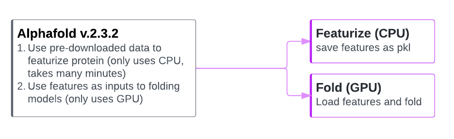

## Running alphafold

Because Alphafold runs both expensive CPU and GPU jobs, we split up the two sets of tasks (featurization and folding).

The python module at `workflow/scripts/run_alphafold_split.py` has flags to allow you to run just the featurization (do on a CPU machine), 
or to fold (using GPU) after loading up a precomputed feature pickle. 

This setup means featurization and folding can be set as two tasks in a Databricks job, with each task running on appropriate compute.

### To setup alphafold:

**EASY install:**
  - Suggest following the install instructions at the root of the repo for all models and app, and skipping the below, but if you only want alphafold you can do the below

**Alphafold install**

1. If not already downloaded in your workspace - download datasets
    - Use 00_create_downloads_workflow to create a yaml that can be used to make a new workflows job
      - In the workflows UI, click "create job", then in the upper right click the kebab menu and select "switch to code version (yaml)"
    - Create the job using the yaml, and run it
    - This runs, in parallel, the downloads (will take ~12 hours for the longest download, most are in the few hours range) 

2. Use 01_create_alphafold_workflow to build a workflow to actually run alphafold
    - creates a yaml you can use to make a new job
    - create the workflows job
    - Note, we set concurrency to 5, meaning 5 users can have jobs running at once and otherwise a queue is formed
       - you can change this behaviour at any time in the UI
 
3. Use the 02_run_alphafold_workflow here to set up a new run 
    - or, in the workflows UI page, hit the arrow next to "run", and select run with different parameters

#### Running alphafold workflow and getting results
 - The app framework in this repo is the best option for one or a few queries, and you can always pick up the raw results from volumes afterwards
 - You can run the alphafold job as part of a computational pipeline too; the 03_run_alphafold_workflow shows how the workflow can be run from code, and you can check the running status, queue status, etc. with the SDK
 - The example_analysis_notebook shows loading up predicted and reference structures and making quick py3Dmol visualizations.

#### Optionally, you can use the notebooks to run alphafold ad-hoc:

 - Run nb_run_af_featurize notebook on a CPU cluster
   - Make sure you use conda with the licensing terms of Anaconda (here we do not use defaults)
   - Enter the protein and name the run as widgets in the notebook.

 - Run nb_run_af_fold notebook
   - Do this on a GPU cluster (will work on CPU but GPU is much faster)
   - Re-enter your protein and run_name in widgets

## license note
The modified alphafold script in ./workflow/scripts is licensed under Apache 2.0 as denoted in the license at the top of the py file. Changes to the original code are noted at the top of the file also.